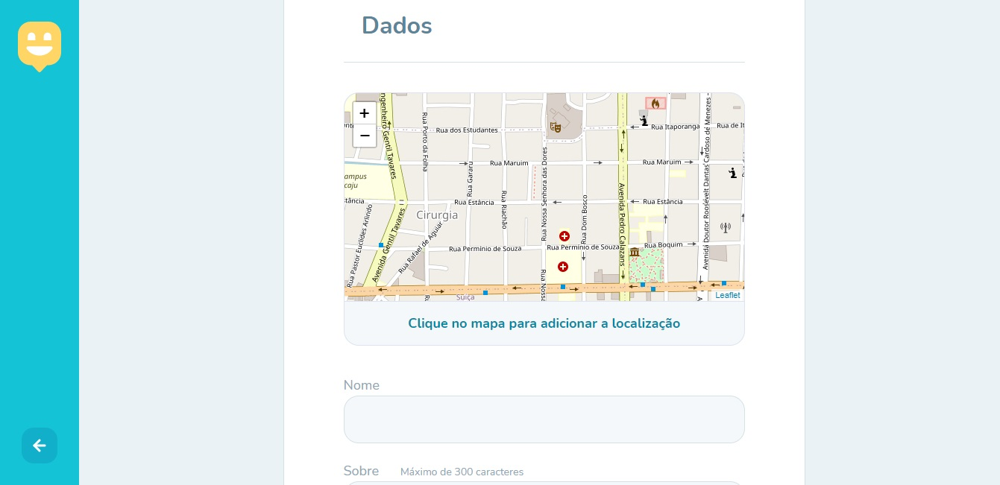

# Happy
 Happy é um site onde você pode encontrar orfanatos registrados e proporcionar alegria para várias crianças.

## Visão Geral

  

## O site conta com:
- Um mapa para localizar orfanatos.
- Ver informações sobre orfanatos.
- Registro de orfanatos.

## Tecnologias usadas:
- HTML
- Css
- Javascript
- handlebars (Template Engine)
- Node
- SqlLite

## Como utilizar ?
```
- Clone esse repositório:
$ git clone https://github.com/SentlySS/Happy Happy

- Entre no diretório:
$ cd Happy

- Instale as dependências:
$ npm install

- Execute:
$ npm start

- Abra seu navegador em:
http://localhost:5500/
```